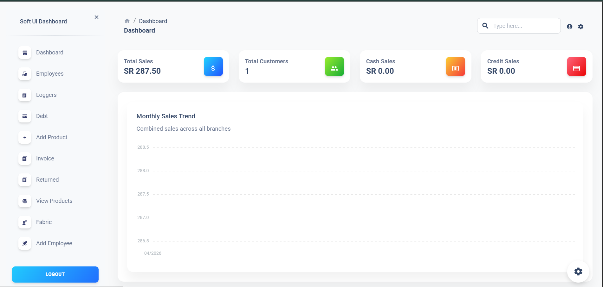
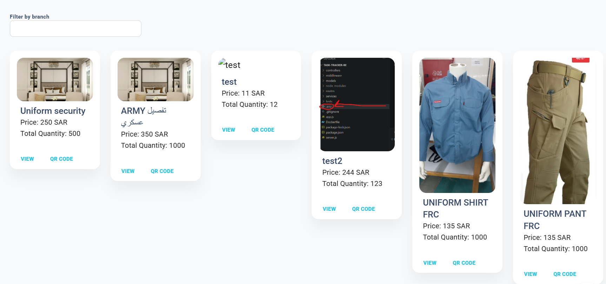
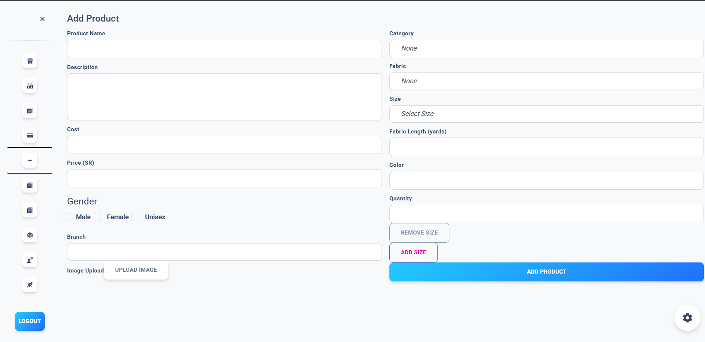
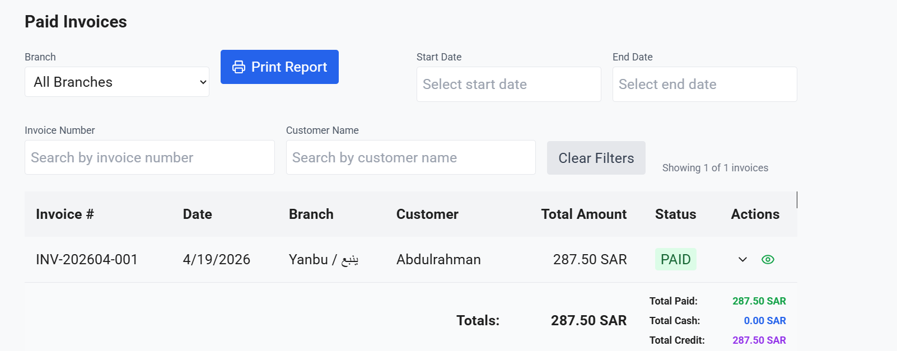

# Multi-Store POS System

A full-stack point-of-sale and factory management system for a clothing manufacturer in Saudi Arabia, used daily across **4 retail stores and 1 production facility**.

**Status:** live in production &nbsp;·&nbsp; **Role:** sole developer (freelance, 2024 – 2025)

> This is a sanitized portfolio version. Sensitive configuration, credentials and client data have been removed.

## The problem

Sales across the client's stores were tracked manually, so management had no single, up-to-date view of sales, stock or branch performance. They needed one system that every store and the factory could use, with consolidated reporting.

## What I built

I owned the project end to end: gathering requirements with the client, architecture, implementation, iterations and production deployment.

- **Multi-store support:** 4 branches and the production facility on one system and one backend
- **Billing:** sales recording and receipt generation at the till
- **Inventory flows:** stock managed per branch
- **Cross-store statistics:** sales reports and analytics across all branches, giving management real-time visibility of operations
- **Role-based access:** separate admin and cashier permissions

## Tech stack

| Layer | Technology |
|---|---|
| Frontend | React / Next.js |
| Backend | Node.js + Express |
| Database | MySQL |
| File storage | Cloudflare R2 |
| Auth | JWT |

## Screenshots

### Sign-in

### Products

### Adding a product

### Transaction

---

Built by **Robin Hmaidan**, full-stack developer · [GitHub](https://github.com/Robin-Hmaidan) · [LinkedIn](https://linkedin.com/in/robin-hmaidan-09a9a0230) · robinhmiadan01@gmail.com
